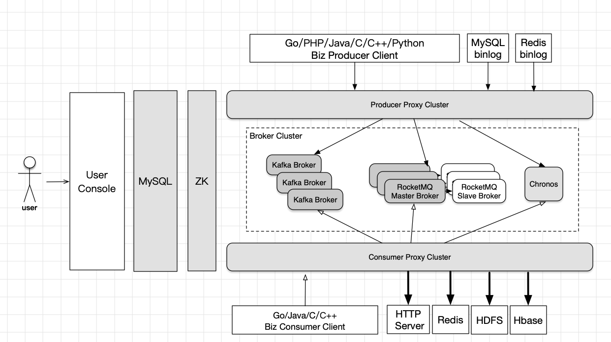

[English](./README.md) | **中文**

 

 

**DDMQ** 是滴滴出行架构部基于 [Apache RocketMQ](https://rocketmq.apache.org/) 构建的消息队列产品。作为分布式消息中间件，DDMQ 为滴滴出行各个业务线提供了低延迟、高并发、高可用、高可靠的消息服务。DDMQ 提供了包括实时消息、延迟消息和事务消息在内的多种消息类型以满足不同的业务需求。 用户通过统一的 Web 控制台和傻瓜式的 SDK 即可轻松接入 DDMQ 生产和消费消息，体验功能丰富、稳定的消息服务。

----------

### 主要功能特性

* 消息模型：支持 P2P, Pub/Sub 等消息模型

* 海量消息存储，支持消息回溯：使用 RocketMQ 和 Kafka 作为消息的底层存储引擎。

* 低延迟高吞吐：毫秒级延迟，单机百万条消息吞吐。

* 延迟消息：单条消息设置精确到秒级的延迟时间，支持 Thrift、HTTP 形式的回调接口。提供了丰富的消息类型，包括延迟消息和循环延迟消息。

* 事务消息： 提供类似 X/Open XA 的分布事务功能，通过 DDMQ 事务消息能够达到分布式事务的最终一致。

* 多语言客户端： 提供了主流开发语言的 SDK，包括 PHP, Java, Go, C/C++, Python 等。API 上保持着最易使用的 High Level 形式。

* 支持复杂的消息转换过滤功能：支持使用 Groovy 脚本在服务端进行消息内容的转化和过滤，能做大大地减少客户端和服务器的数据传输，同时减少客户端的处理消息的负载。

* 提供了一个易用性高的 Web 用户控制台，方便用户在控制台上申请 Topic, ConsumerGroup, Subscription 等资源。 提供消费进度的查看和重置功能。

----------

### DDMQ 架构图

----------

### 模块介绍

* carrera-common 提供其他模块的公共代码，封装了 ZK 操作。

* carrera-producer 生产消息代理模块，内置 Thrift Server， 负责将 client 的生产的消息转发给 broker。

* carrera-consumer 消费消息代理模块， 内置 Thrift Server， 提供 SDK 拉取和 HTTP 推送等方式将消息发给订阅方。

* carrera-chronos 延迟消息模块，使用 RocksDB 作为延迟消息的存储引擎。

* carrera-sdk 生产和消费消息的 SDK 代码， 支持 Java/C/C++/Go/PHP/Python 等主流语言。 

* rocketmq 基于开源 RocketMQ 修改(版本 4.2.0)，增加了 broker 主从自动切换等特性。

* carrera-console 基于 Spring 开发的用户控制台，管理配置。

* carrera-monitor 监控模块，提供消费积压监控和集群健康监控。

* carrera-docker 提供单机版的 DDMQ 镜像，方便部署和使用。

----------

### 部署
#### 外部依赖
* 64bit OS, Linux/Unix/Mac
* 64bit JDK 1.8+
* Maven 3.2.x
* MySQL 5.7.x
* Tomcat 7/8/9
* Zookeeper 3.4.x

#### 部署步骤

*  部署 MySQL & Zookeeper
 	>  安装 MySQL 5.7 参考： <https://dev.mysql.com/doc/mysql-installation-excerpt/5.7/en/>

 	>  安装 Zookeeper 3.4.x 参考： <https://zookeeper.apache.org/doc/r3.1.2/zookeeperStarted.html>
 	
 	
*  部署 RocketMQ

    >部署文档参考： [rocketmq](rocketmq/README.md)
  
*  初始化 MySQL 表结构和数据

    >部署文档参考： [mysql](carrera-console/README.md)
  
*  部署用户 Console 服务

    >部署文档参考： [console](carrera-console/README.md)

*  初始化 Zookeeper 节点数据
	
	> 调用 console 接口： 
	
	> * curl http://console_addr:8080/carrera/api/odin/internal/v4/initZkPath
	> * curl http://console_addr:8080/carrera/api/odin/internal/v4/initAllZk

*  部署 Producer Proxy

    >部署文档参考：[部署 pproxy](carrera-producer/README.md)

*  部署 Consumer Proxy

    >部署文档参考：[部署 cproxy](carrera-consumer/README.md)

*  部署 Chronos

    >部署文档参考：[部署 chronos](carrera-chronos/README.md)
  
### 使用

  * [DDMQ 用户控制台使用指南](carrera-console/USAGE.md)

### Contributing
Welcome to contribute by creating issues or sending pull requests. See [Contributing Guide](CONTRIBUTING.md) for guidelines.

### Community

### License

DDMQ is licensed under the Apache License 2.0. See the [LICENSE](LICENSE) file.
