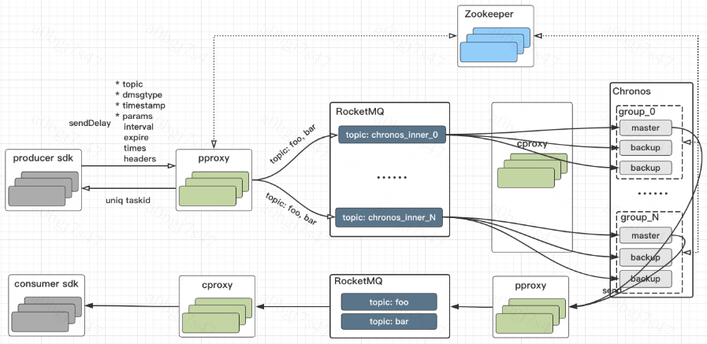

**English** | [中文](./README_CN.md)
## DDMQ Chronos ##

Chronos is the delay message module of DDMQ. Chronos provides massive delay message storage and uses RocksDB as underlying storage. 

### Features ###

* Rich message type: delay message, delay-loop message and transactional message.
* high availability & high reliability.
* Easy-to-use: use the same SDK and console as realtime message.
* Huge Volume: use disk as storage.

### Architecture ###

<center>

</center>


### Deploy ###
* create inner topic and inner group in Console
* modify chronos.yaml
* run ```build.sh``` to build package
* start chronos with ```control.sh start```