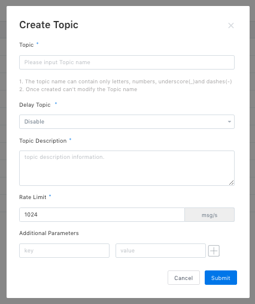
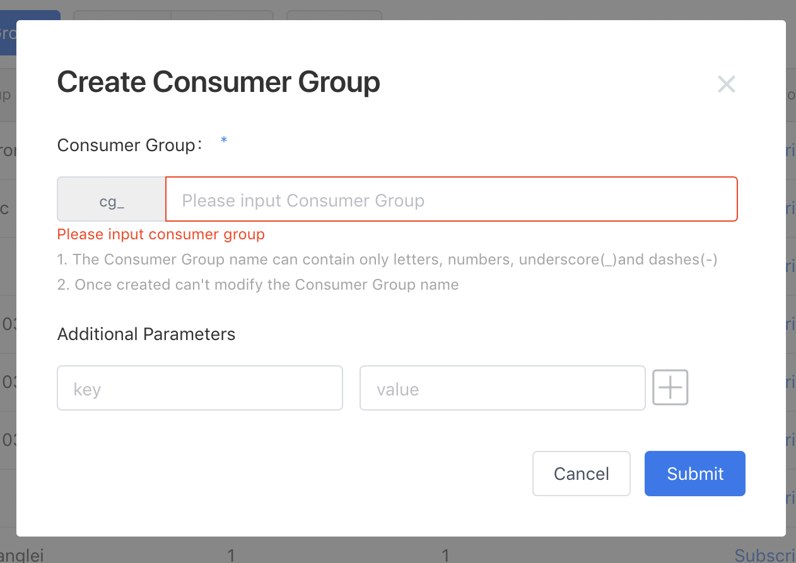
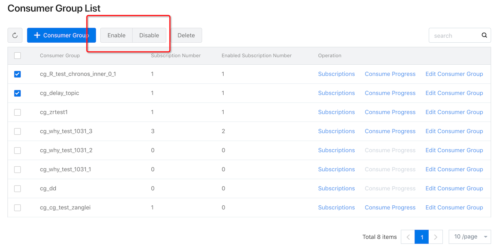
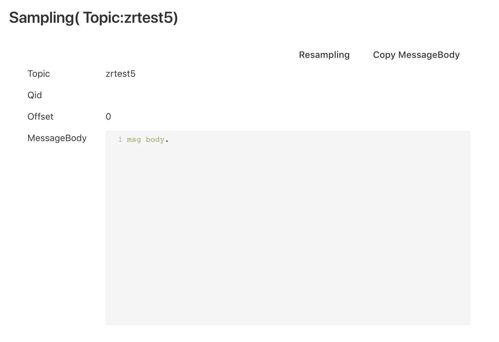
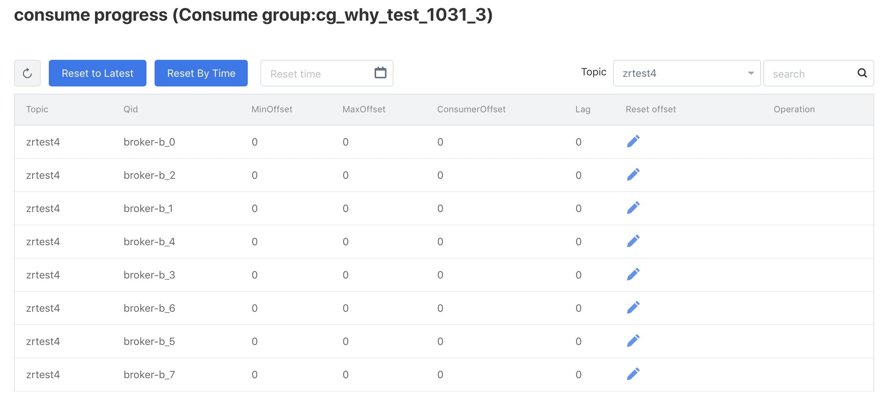
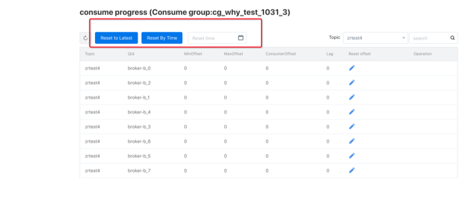
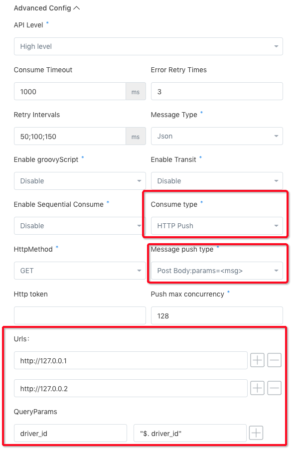
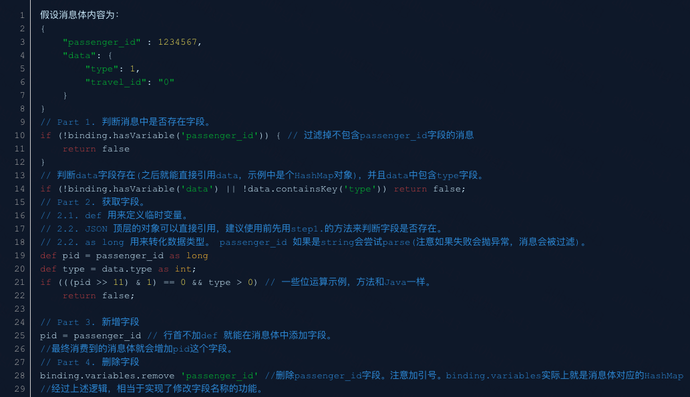
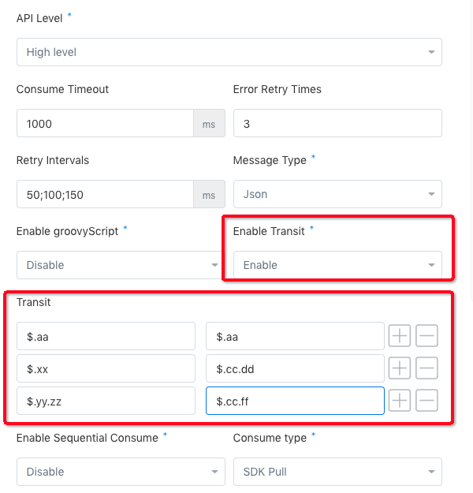
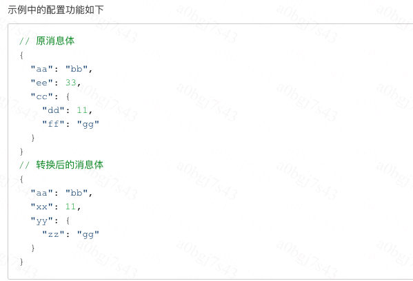

## DDMQ 用户控制台使用指南 ##

DDMQ 用户控制台((以下简称 Console)提供了使用 DDMQ 的一站式服务平台。用户可以在 Console 上管理消息的生产和消费；管理 topic、group、subscription 等资源的创建和维护。配置生产和消费的限流、消息推送的方式（HTTP or SDK or 第三方存储直写）、Groovy 脚本、启停消费、查看消费进度、重置消费进度，采样消息，等等。

----------

### 生产消息 ###
消息的生产者在生产消息前需要创建 topic 资源（否则不能使用 sdk 生产消息，会报 topic not in white list 错误）。   
创建 topic 的主要参数有：  

* topic 名称： 需要全局唯一；  
* delayTopic： 是否是延迟 topic，使用延迟消息的生产方必须指定为 true，延时消息不能跟实时消息混用同一个 topic；    
* Rate Limit： 生产消息的限流值，**超过限流值时将拒绝写入**；  

----------

### 消费消息 ###
消息的消费者在消费消息前需要创建消费组和订阅等资源，然后才能启动消费。对于 HTTP 推送和第三方存储直写的消费方式，在 Console 中启动消费后就会推送消息到下游。SDK 的消费方式则需要配合使用 SDK 来拉取消息。

#### 第一步： 创建消费组 ####
在 Console 中创建消费组。

#### 第二步： 添加订阅 ####
当创建好消费组后，就可以在消费组中增加订阅了。

##### 订阅参数填写说明 #####
创建订阅的主要参数有：

* Group 

  消费组名，要求全局唯一（需要预先创建好）;
* Topic

  消费组中要订阅的 topic；
  
* Consume maxTps

  消费限流值，最大的推送消息并发，当生产的 tps 大于消费的 tps 时，会触发消费限流，将消息积压在 broker 中，**导致消费消息的延迟增大**；
* Receive Pressure Traffic

  是否接收压测流量，为 true 时 DDMQ 会过滤标识为压测消息的消息（这个标识由生产方在消息的 properties 中设置，参考 SDK DEMO）；
* API Level

  分为 High Level 和 Low Level 两种； DDMQ 的消费端的主要功能都是通过 High Level 的方式提供的，一般建议使用 High Level 的方式， Low Level 方式适合实时性要求更高以及需要自己控制 offset 提交的场景，通常为 flink 等实时计算的场景。  
* consumeTimeout

  消费超时时间，HTTP 推送模式下请求的超时时间，SDK消费时, 消息消费的超时时间。超时后消息可以被重新消费；
* Error Retry Times

  异常情况下的重试次数，HTTP 推送模式代表由于 status code != 2xx 的原因导致的重试次数，SDK 拉取模式时代表由于超时响应（包括网络异常）导致最大重试次数，-1 代表无限重试。异常重试的重试时间间隔为（512ms, 1s, 2s, 4s, 8s,...,128s, 128s...) 。固定不能改。
* Retry Interval

  正常重试间隔，下游消费方要求的重试次数，HTTP 推送模式代表业务方返回未知错误码时的重试时间间隔（单位毫秒），SDK 拉取模式时代表返回 false 时的重试时间间隔，重试次数为数组长度，最后一位为 -1 时，表示按照上一个重试间隔无限重试，例如：150;300;600 代表业务方返回未知错误码或者返回 false 时会重试3次，每次重试间隔依次是 150、300、600
* Sequential Consume

  顺序消费的配置，非顺序消费场景无需关注，内容为以下三项之一：
	* QID：按照 qid 有序消费。
	* KEY: 按照消息的 key 顺序消费（key 由生产方在生产时指定）。
	* JsonPath：按照 JsonPath 指定的字段的取值有序消费，前提是消息体为 JSON 格式。参考：http://jsonpath.com/；
* Consume Type

  消费方式；分为 HTTP 推送、SDK 拉取和第三方存储直写（如 HBase、HDFS、Redis）
* URLs

  HTTP 推送方式时的推送 URL，指定多个 URL 的话每次会随机选取一个 URL 推送(**注意: URL 一定要带上"http://"**)；
* GroovyScript

  配置 groovy 脚本，在将消息推送前会执行给定的 groovy 脚本对消息就行预处理、过滤，通过groovy脚本可支持消息过滤、消息体转换等；
* Transit

  消息体预处理，在消息推送前会根据指定的 k-v 做消息转换，选中此Action时，需填写参数Transit，Transit是一组 k-v 值，k为转换后字段的JsonPath, v为转换前字段的JsonPath

#### 第三步： 启动消费 ####

#### 特色功能 ####
* 消息体采样  

  >通过采样获取最新写入 topic 的数据

* 查看消费进度

  > 按照 queue 的粒度查看消息的消费进度，是否存在积压情况

* 重置消费进度

  > 支持按照时间重置 offset，消费老数据，重置 offset 前需要先停止订阅的消费；

  
#### 使用示例 ####
* HTTP 推送使用示例

  > 在 HTTP 推送消费模式下，有两种消息推送方式；Post Body:params=\<msg> 和 Post Body:消息体第一层打开。 HTTP 方式支持 GET 和 POST 两种。 支持填写多个推送 Url，实际推送时会随机选择一个 Url 进行推送。QueryParams 选项支持将消息体中的字段以 k-v 的形式拼接到 url 的 queryParm 中。

* GroovyScript 使用示例

  > 适用于需要通过 groovy 脚本对消息做过滤、转换的场景

  >- 消息体过滤

  >  以返回值确定消息体是否要过滤。只有 return true 的消息才会进入下一个action处理。其他情况消息都会被过滤掉，不会返回给客户端，比如：return false; return 其他任意非true的对象。运行时抛异常。
  >- 修改消息体内容
 
  >  groovy运行环境中有个binding对象可以获取运行环境中的数据，下面是一些使用示例:

* 消息体转换示例

  > 如果需要消息体转换的功能，需添加额外的action Transit 并填写相应的参数

----------
