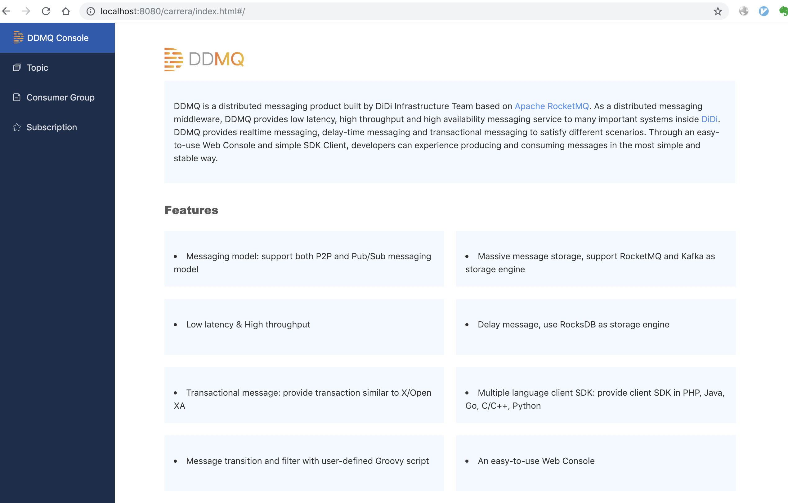

**English** | [中文](./README_CN.md)
## DDMQ Docker ##

DDMQ is not easy to deploy in cluster mode since it has multiple modules. So we provide this docker image that makes running standalone DDMQ very easy. 

### Image Content ###

* standalone Zookeeper（Version 3.4.10）
* tomcat 9 and console 
* rocketmq（one namesvr、one master broker）
* standalone consumer-proxy
* standalone producer-proxy
* standalone chronos

Note：DDMQ Container requires a MySQL 5.7 container.

### Usage ###
* Install Docker
* Install MySQL Client（recommend 5.7.x）
* run ```build.sh``` to build packages
* run ```play-ddmq.sh``` （will download centos7,mysql,tomcat,zookeeper in first run）
* Visit DDMQ Web Console  

    > <http://localhost:8080/carrera/index.html>


    ><center>
    >
    ></center>

    >*Note：producer-proxy port: 9613、consumer-proxy port: 9713*
